# AI-SCH 仿真器

**面向 HarmonyOS NEXT 的原理图仿真、PCB 布局与 AI 辅助电路设计平台**

在国产操作系统上提供混合信号仿真、8051/STM32 HEX 调试、虚拟仪器、**PCB 2D 布局与 3D 板级预览**，以及以 **工程化 AI Prompt** 与 **多 Agent 质量总线** 驱动的原理图闭环：「澄清 → 选型 → 布局 → 建网 → WAR 布线 → QA」。PCB 工作区提供 **正/反向标注**、多层铜箔、DRC、Gerber / 交换导出，以及 **经典正交自动布线**（`autoRoutePcb`）——服务高校实验、竞赛训练与方案预验证。

[English](./README.md) | 简体中文

**比赛材料：** [作品说明文档](./docs/作品说明文档.md)  
**官网：** [HarmonyOS Hardware AI Auto-Routing Simulation](https://chuqing-web.github.io/HarmonyOS-Hardware-AI-Auto-Routing-Simulation-Web/)  
**源码 / 发布：** [GitHub](https://github.com/chuqing-web/AI-Auto-Routing-Hardware-Simulation)

<p align="center">
  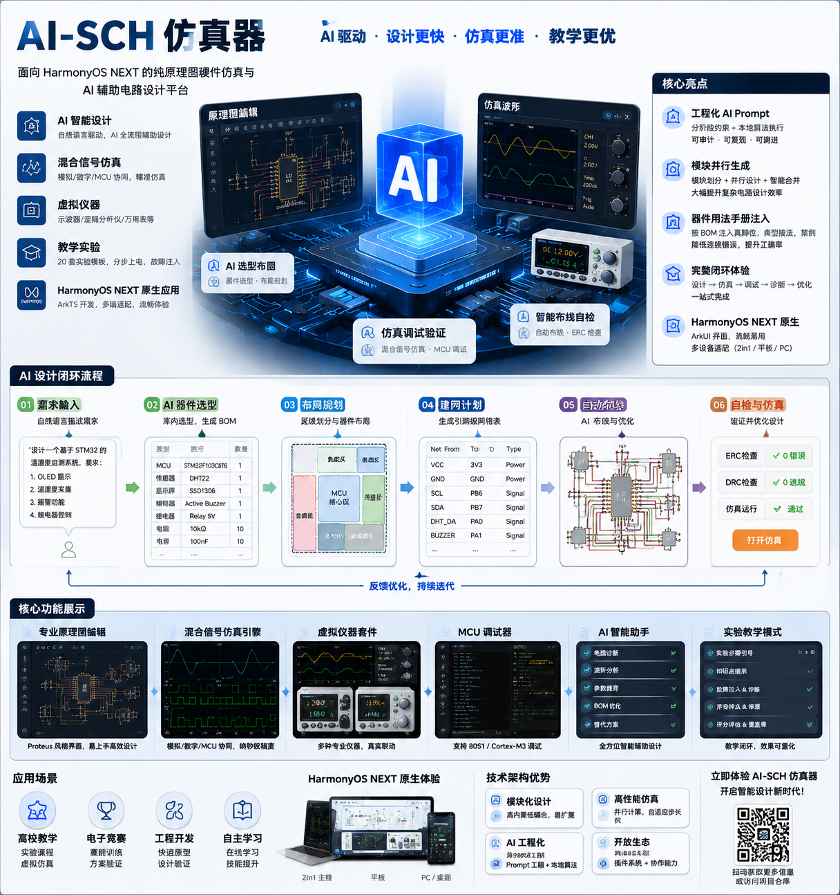
</p>

---

## 目录

- [一、项目背景](#一项目背景)
- [二、核心创新点](#二核心创新点)
- [三、AI Prompt 工程体系](#三ai-prompt-工程体系)
- [四、功能全景](#四功能全景)
- [五、技术架构](#五技术架构)
- [六、AI 闭环流水线](#六ai-闭环流水线)
- [七、仿真与调试能力](#七仿真与调试能力)
- [八、器件库与实验模板](#八器件库与实验模板)
- [九、工程结构与模块](#九工程结构与模块)
- [十、快速开始](#十快速开始)
- [十一、演示建议（评审录屏）](#十一演示建议评审录屏)
- [十二、应用场景](#十二应用场景)
- [十三、工程质量与验证](#十三工程质量与验证)
- [十四、发展展望](#十四发展展望)
- [十五、许可证与声明](#十五许可证与声明)

---

## 一、项目背景

电子设计与嵌入式教学长期依赖 Windows 桌面工具链。随着 HarmonyOS NEXT 在 PC（2in1）、平板与教室终端上的普及，生态中仍缺少一款：

1. **原生运行于 HarmonyOS** 的原理图仿真与 PCB 布局软件；  
2. 同时覆盖 **模拟 / 数字 / MCU** 混合信号实验，以及 **原理图 ↔ PCB** 教学板；  
3. 能把 **大模型能力落地为可执行原理图拓扑**（而不仅是聊天答疑）——且 Prompt 可版本化、可审计、可演进；  
4. 面向课堂的 **实验模板（.schsim / .pcbsim）、分步上电、故障注入与覆盖率评估**。

**AI-SCH 仿真器**（包名 `com.elecdraw.aischsim`，厂商 ElecDraw，版本 **1.1.1**）正是为填补上述空白而设计：在 ArkTS / ArkUI Stage 模型上构建模块化 HAR 架构，以统一拓扑契约 `SchTopology` 贯穿编辑、仿真、AI、持久化与教学全链路。

| 项目 | 说明 |
|------|------|
| 应用名称 | AI-SCH 仿真器 |
| Bundle | `com.elecdraw.aischsim` |
| 版本 | **1.1.1**（`versionCode` **1001001**；`AppScope/app.json5` / `AppVersion.ets` / `oh-package.json5`） |
| 平台 | HarmonyOS NEXT · 产品 SDK **`6.1.1(24)`**（见 `build-profile.json5.example`） |
| 设备形态 | **2in1（主推）**、tablet、default |
| 语言与 UI | ArkTS + ArkUI · Stage 模型 · 模块化 HAR |
| 许可证 | [Apache-2.0](LICENSE) |

---

## 二、核心创新点

本项目的差异化不在「再做一个聊天框」，而在 **把 LLM 约束成可仿真原理图**，并配套原生 PCB 教学工作区，做成可教、可测、可演示的应用闭环。

| # | 创新点 | 说明 |
|---|--------|------|
| 1 | **工程化 AI Prompt（权威源）** | `skill/prompts/` 为分阶段 Prompt 唯一权威源（**原理图 00–09**）；同步镜像到 `templates/*.ets`，由 `PromptLoader` 运行时加载；md↔ets 防漂移，真机不读磁盘 skill |
| 2 | **多 Agent 质量总线** | `AgentPipelineCoordinator` + `CircuitBlackboard`：需求 → 选型 → 布局 → 建网 → WAR 布线 → QA；阶段批判、`qualityHardFail`、澄清后快照续跑 |
| 3 | **分阶段约束 JSON + 本地硬引擎** | Prompt 产出结构化约束；GA 摆放、语义建网、**WAR**（`WireAutoRouter`，经 `WarRouteAdapter`）、ERC / 几何门禁在本地执行 |
| 4 | **需求澄清（A/B/C）** | `RequirementsAgent` 仅追问影响拓扑的关键歧义；禁止静默假图；经黑板快照续跑 |
| 5 | **模块化并行生图** | 复杂电路可选「整图一次」或「模块并行」：整体设计 + 边界门禁 → 真并行子流水线 → pin-to-pin joints 合并 |
| 6 | **器件用法手册注入** | 选型落地后，按本次 BOM 注入 `DeviceUsageManual`（真脚 / 典型接法 / 禁例） |
| 7 | **HarmonyOS 原生混合信号内核** | 自研 MNA 模拟引擎、事件驱动数字引擎、8051 / 进程内 Cortex-M3 教学路径，全局纳秒调度器协同 |
| 8 | **教学—仿真—诊断闭环** | 20 套配对 `.schsim` / `.pcbsim` 实验 + HEX 固件 + 知识点提示 + 分步上电 + 故障注入 + 覆盖率仪表盘；仪器与网络实时绑定 |
| 9 | **多厂商 AI 治理** | **17** 类提供商模板、任务级 API 绑定、配额仪表盘、离线 / 代理 / 降级策略 |
| 10 | **PCB 2D/3D + 经典自动布线** | 多层铜箔（F/B + In1…In6）；SCH↔PCB 标注；**`autoRoutePcb`** 正交 L 链（Cu≥4：H/V 分铜层 + 拐角过孔）；DRC；Gerber / PCB 交换文件 / STEP 预览；交互式 3D |

**相对传统桌面 EDA：** 国产 OS 原生落地 + AI 可执行原理图输出 + 原理图/PCB 教学闭环。  
**相对纯 Chat 助手：** Prompt 分阶段工程化、多 Agent 门禁、拓扑落地、ERC / 仿真可验证、失败可诊断。

> **说明：** 早期 PCB 多 Agent LLM 铜箔路径（`PcbRouteCoordinator`、skill 10–14、`aiPcbAutoRoute`）已从**当前工作树移除**。生产 PCB 自动布线为上述经典引擎。`common` 中仍保留 `pcb_route/` 残件（`PcbLocalStrategy`、几何落铜辅助等）供后续接线——**当前未挂到 UI**。

---

## 三、AI Prompt 工程体系

> 把 Prompt 当作**一等工程资产**，而不是散落在业务代码里的字符串。

### 3.1 权威源 → 运行时镜像

```
skill/SKILL.md          （规则总纲：电路分类、防幻觉、MCU/运放强制清单…）
skill/prompts/*.md      （分阶段 system + userTemplate，含 frontmatter；原理图 00–09）
        │ 人工同步
        ▼
features/ai_engine/.../prompts/templates/*Prompt.ets
        │ PromptLoader.load(runtime_key)
        ▼
LLM JSON  →  Agent 阶段 + 本地算法引擎  →  SchTopology
```

- **权威文案**：[`skill/prompts/`](./skill/prompts/README.md)（v5.1）  
- **规则总纲**：[`skill/SKILL.md`](./skill/SKILL.md)  
- **流水线阶段**：[`skill/references/pipeline-stages.md`](./skill/references/pipeline-stages.md)  
- **索引**：[`skill/references/prompt-templates.md`](./skill/references/prompt-templates.md)  
- **加载器**：`PromptLoader`（拒绝未知模板静默回退；拒绝空渲染）  
- **遗留**：根目录 `ai_prompt_lib/*.json` 为早期资产——**当前权威源是 `skill/`**

### 3.2 分阶段 Prompt 映射

| 阶段 | skill 文件 | runtime_key | 管线职责 |
|------|------------|-------------|---------|
| 公共规则 | `00_shared_rules.md` | — | 经 `renderEnriched` 注入 |
| 需求 | `09_requirement.md` | `requirement` | `RequirementsAgent`：`RequirementSpec` 或 A/B/C 澄清 |
| 选型 | `01_device_select.md` | `device_select` | 功能模块 + 库内型号；防幻觉 / OOD |
| 布局 | `02_layout.md` | `layout` | 区域 / 邻接 / 密度 → GA 摆放 |
| 建网 | `03_net_plan.md` | `net_plan` | 管脚级网络表（主战场 + 用法手册） |
| 布线 | `04_route.md` | `route` | 模拟 / 数字 / 晶振权重 → WAR |
| 自检 | `05_self_review.md` | `self_review` | ERC + 几何 → 修复建议（QA Agent） |
| 诊断 | `06_diag.md` | `diag` | 静态 / 动态诊断任务 |
| 遗留整图 | `07_gen_sch.md` | `gen_sch` | 兼容路径（生产整图勿依赖） |
| 模块规划 | `08_modular_plan.md` | `modular_plan` | 并行生图：模块边界 + joint 门禁 |

运行时片段：`IntentPromptFragments`、`DeviceInstrumentFragments`、`EditPlanPrompt`、`StageCapabilities`，与公共规则一并注入。

### 3.3 运行时动态注入（非静态正文）

`PromptLoader` 在调用时从拓扑 / BOM 组装上下文，避免每次把整库塞进 Prompt：

| 注入项 | 用途 |
|--------|------|
| `library_catalog` / libDevId 列表 | 选型与模块规划限制在库内 |
| `DeviceUsageManual`（完整 / 精简） | 管脚级接法与禁例 |
| 管脚世界坐标 / 选中 AABB | 几何感知 net_plan |
| 命名管脚默认值 | MCU / 运放几何（`NamedDevicePinDefaults`） |
| 线径 / 密度报告 | self_review 几何覆盖 |
| 拓扑反模式守卫 | 增强防护 |

### 3.4 维护约定

1. 改规则 → 编辑 `skill/SKILL.md`  
2. 改某阶段文案 → 编辑对应 `skill/prompts/0x_*.md`  
3. **必须**同步同名 `*Prompt.ets`，否则 App 行为不变  
4. 几何常量与代码对齐（`HIT_PAD=22`，无关脚间隙 ≥20 mil，…）  

---

## 四、功能全景

### 4.1 应用壳层与首页

- `SplashPage` → `HomePage` → 原理图（`Index`）或 PCB（`PcbPage`）  
- 首页：Getting Started / Start / Help / About；公告面板；GitHub 发布动态（`HomeAnnouncementService` / `HomeReleaseService`）  
- 工程向导创建 `.schsim` / `.pcbsim`；最近工程；崩溃恢复提示  
- 授权条：默认 Free；Star 仓库后经 GitHub OAuth Device Flow 解锁 Pro  

### 4.2 原理图编辑

- 画布交互、图层、网格吸附、撤销/重做、批量对齐/分布  
- 总线、网络标签、探针、批注、层次化子电路  
- ERC：静态 / 深度 / 动态  
- 菜单、工具栏、明暗主题、快捷键  
- 器件别名表，降低习惯迁移成本  
- 命名器件管脚 + WAR 布线顺序（与 AI 布线同源，经 `WarRouteAdapter`）

### 4.3 混合信号仿真

- 模拟：`AnalogEngine`（MNA + Newton–Raphson；二极管/LED/BJT/运放/稳压/继电器/电位器）  
- 数字：`DigitalEngine`（事件驱动；74HC 时序、扇出、建立/保持）  
- MCU：8051 与 Cortex-M3 **进程内**路径（`QemuMcuBridge` = 教学级 Thumb 解释器——**非**外部全系统仿真器），与模拟/数字网络同步（GPIO、ADC、USART）  
- 调度：`GlobalScheduler`（纳秒级，自适应步长）  
- 分析：瞬态 / DC / AC / 混合 / 噪声 / 蒙特卡洛 / 参数扫描  
- 交互：按键、电位器抽头、继电器触点  
- 故障注入：**9** 种枚举；波形/批量引擎覆盖常用子集  

### 4.4 MCU 调试

- Intel HEX32 解析与 Flash 适配检查  
- 8051 SFR、Cortex-M3 核心寄存器、断点（地址/数据）、单步/步过  
- 虚拟 UART 日志；与仪器串口终端回环  

<p align="center">
  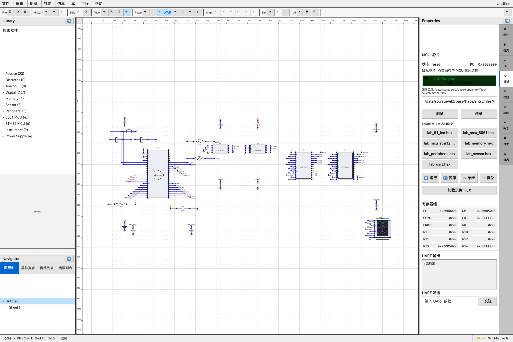
</p>

### 4.5 虚拟仪器

示波器（CH1–4、时基、触发、运算/FFT、光标）、逻辑分析仪、万用表（四端 `V/A/OHM/COM`）、直流电压/电流表、功率表、频率计、信号源、UART 终端（定时脚本）。引擎位于 `features/instruments/.../engines/`；侧栏绑定实时网络并由仿真帧刷新。

**示波器显示路径（当前）：**

| 层 | 行为 |
|----|------|
| 侧栏 | ROLL 写入 → 滚动；按活信号自动时基 / V/div；窗口化捕获 |
| 全历史 API | `getOscilloscopeWaveFull` / `captureWaveFullHistory` — 整次运行峰值保持导出 |
| 放大叠加层 | 双击波形 → `InstrumentWaveExpandOverlay`：默认 **全览**，缩放/平移，「全览」复位 |
| 画布 | `OscilloscopeWaveCanvas`：每像素 min/max 包络；写入填充时 NaN 间隙 |

<p align="center">
  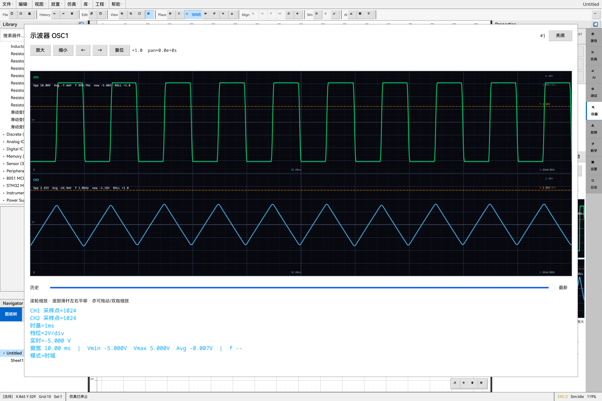
</p>

<p align="center">
  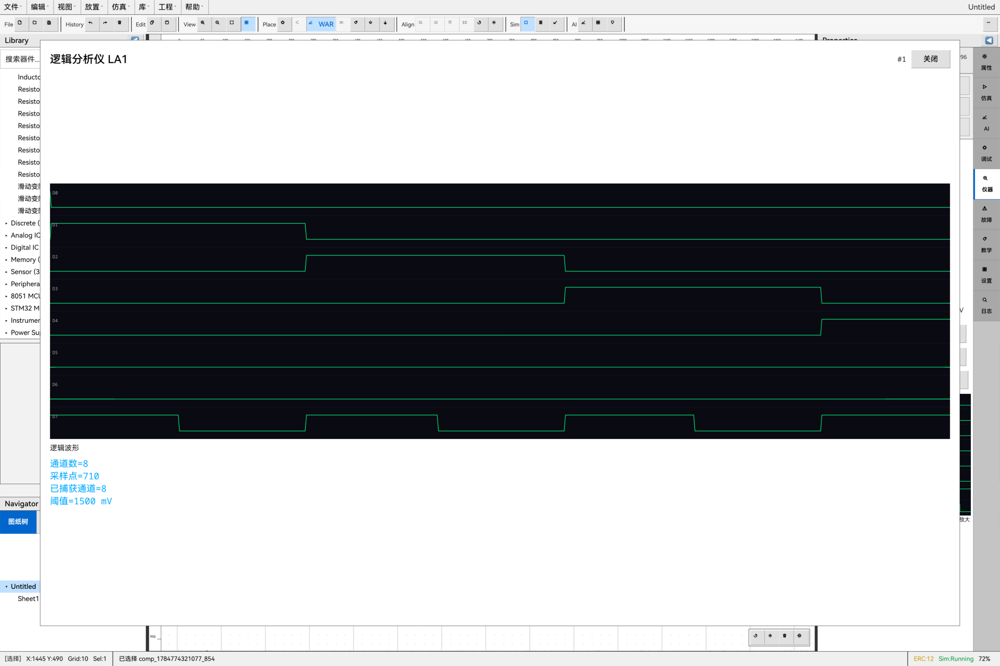
</p>

### 4.6 AI 辅助设计（原理图）

自然语言 **需求理解**（可选 A/B/C 澄清）、选型、布局约束、建网、WAR 布线、整图一次 / 模块并行、多轮 **增量编辑**、**自检**（WAR + QA）、静/动态诊断、波形分析、参数建议、替代器件、BOM 优化。完整闭环见 [第六节](#六ai-闭环流水线)。

生产路径需要 **真实 LLM + 本地硬引擎**；**禁止**用实验模板 / `CircuitTemplates` 关键词捷径冒充 AI 生图。实验模板仅经教学面板加载。

<p align="center">
  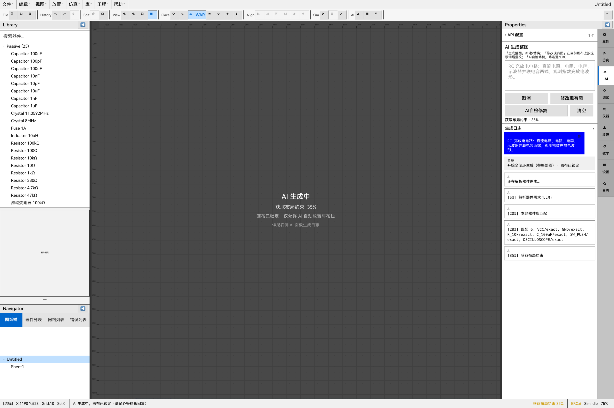
</p>

<p align="center">
  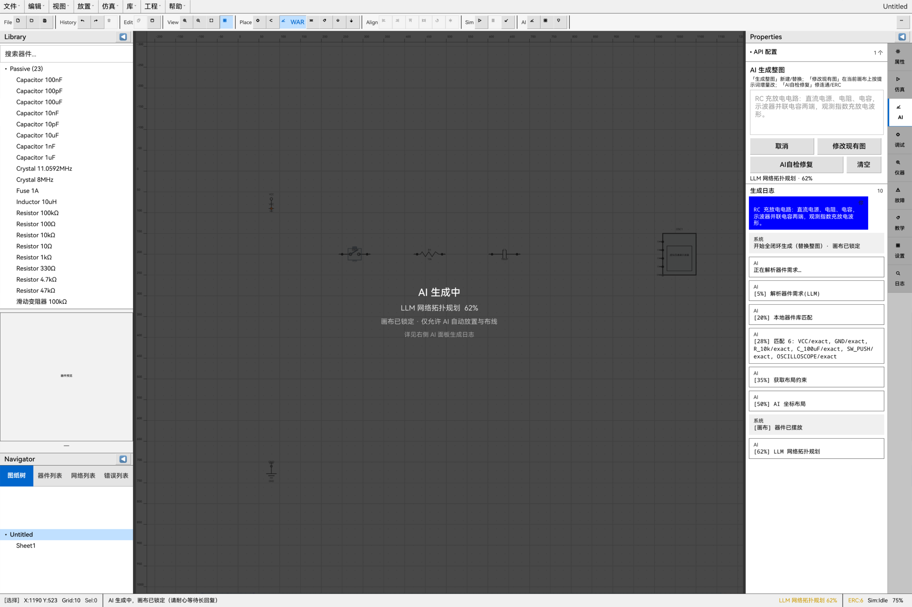
</p>

<p align="center">
  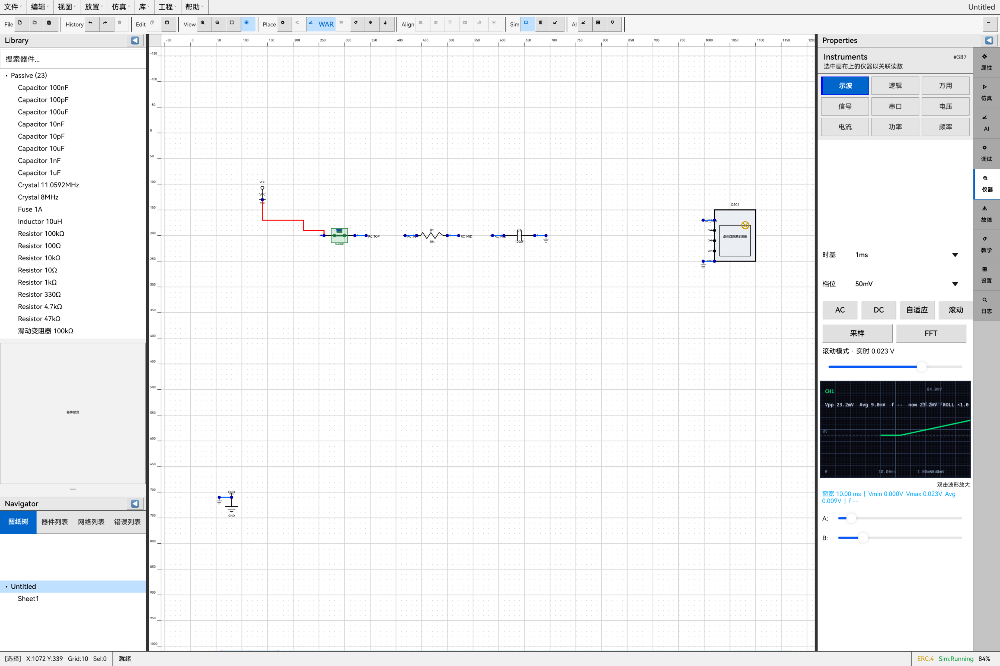
</p>

### 4.7 工程与扩展

- `.schsim` / `.pcbsim` 存取、自动保存、崩溃保护、会话恢复  
- 导入：常见第三方原理图格式的 **基础解析器**（常见子集，非完整 EDA 对等）  
- 导出：PNG / SVG、简易 PDF、波形 CSV、BOM / 网表；PCB **Gerber** / **PCB 交换文件** / 简化 STEP  
- 协作：本地快照、工程锁、批注；**实时 WebSocket 同步需外部服务器**（骨架）  
- 插件：清单解析、签名检查、权限门禁；沙箱为 **权限门控桩执行器**  
- 授权：`LicenseManager` / `FeatureGate`；**默认 Free**；Star [`HarmonyOS-Hardware-AI-Auto-Routing-Simulation`](https://github.com/chuqing-web/HarmonyOS-Hardware-AI-Auto-Routing-Simulation) 后经 GitHub OAuth Device Flow 解锁 Pro；**每次启动复核；离线 = Free**  

### 4.8 PCB 布局与 3D 预览

PCB 工作区（`features/pcb_editor` + `entry` 的 `PcbPage` / `PcbCanvas`）：

| 能力 | 说明 |
|------|------|
| 图层 | F.Cu / B.Cu、In1…In6、丝印 / 阻焊 / 钢网、Edge.Cuts；铜层数可配（2 / 4 / 6 / 8） |
| 编辑工具 | 选择、布线（90° / 45° / 弧）、过孔（通孔 / 盲 / 埋）、铺铜与多边形区、板框、测量、放置封装 |
| SCH↔PCB | `forwardAnnotateFromSchematic` / `reverseAnnotateToSchematic`；飞线；焊盘–网络绑定（`PcbPinBindUtil`） |
| 自动布线 | **经典** `runAutoRoute` → `autoRoutePcb`：正交多策略 L 链；Cu≥4 时 H/V 分铜层 + 拐角过孔；clearance 校验；异步切片让出主线程 |
| DRC | 间隙、短路、未连；`pcb_route/` 内教学辅助（如 `ensureAllCopperUsed`） |
| 2D 视图 | 单层 / 变暗 / 叠层、网络高亮、推挤与蛇形辅助 |
| 3D 视图 | 轨道 / 预设 / 正交；真实 · 透视 · 爆炸 · 剖切 · 高度图；可选 STEP 绑定与 PBR/MSAA |
| 导出 | Gerber 套件、PCB 交换文件、简化 STEP 预览 |

<p align="center">
  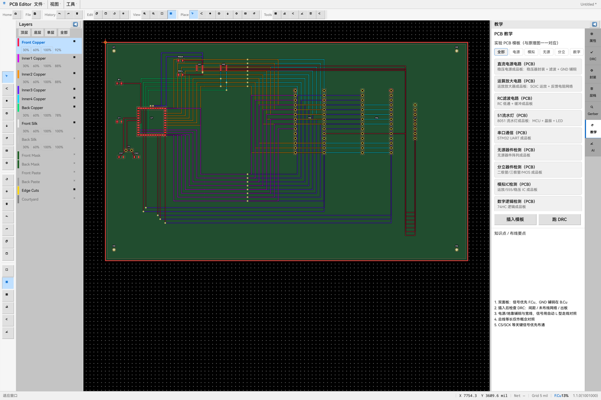
</p>

<p align="center">
  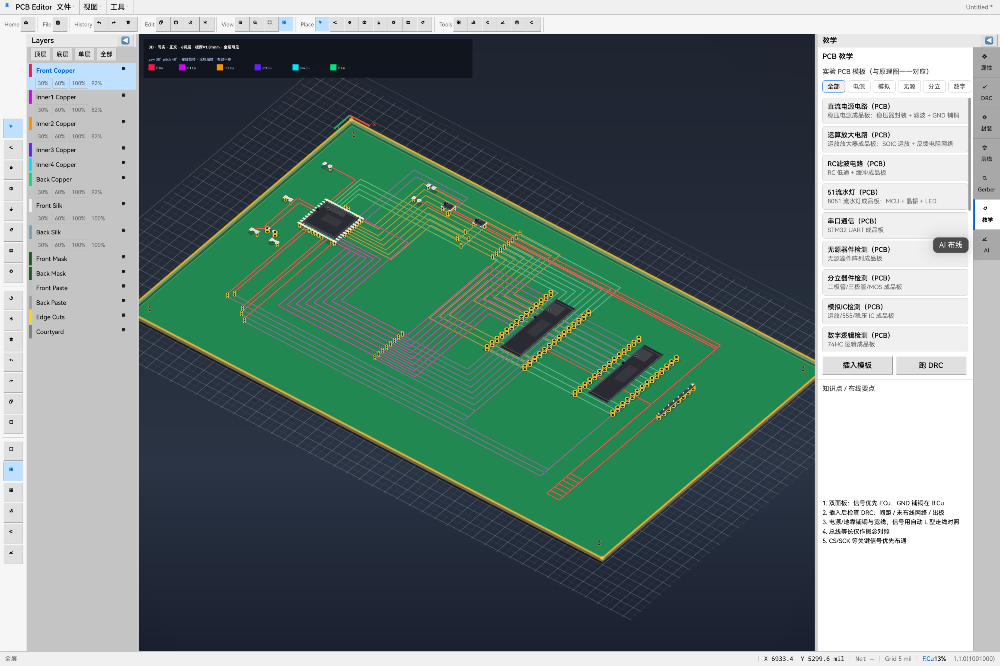
</p>

---

## 五、技术架构

### 5.1 分层视图

```
┌─────────────────────────────────────────────────────────────┐
│  entry (HAP)                                                 │
│  Splash → Home → Index / PcbPage · AppService · SimWorker    │
├─────────────────────────────────────────────────────────────┤
│  features/* (HAR) × 10                                        │
│  schematic_editor │ pcb_editor │ component_library            │
│  simulation_kernel │ hex_debugger │ instruments               │
│  ai_engine │ ai_api_manager │ file_persistence │ plugin_system│
├─────────────────────────────────────────────────────────────┤
│  common (HAR)  SchTopology · PcbDocument · ERC/DRC 辅助       │
│               WAR · autoRoutePcb · pcb_route · Gerber / License│
├─────────────────────────────────────────────────────────────┤
│  资产  DeviceLibrary · skill/prompts · Test_Template          │
│        (.schsim + .pcbsim) · hex_files · picture              │
└─────────────────────────────────────────────────────────────┘
```

### 5.2 共享契约：`SchTopology` 与 `PcbDocument`

编辑器、仿真内核、AI 流水线、持久化、插件与教学模板共享 **`SchTopology`**。PCB 路径共享 **`PcbDocument`**。正/反向标注器与 `TopologyAdapter` 保持 SCH ↔ PCB 互通。

### 5.3 EventBus 解耦

`EventBus` 覆盖原理图 / PCB 变更、仿真起停步进、MCU 状态、AI 进度、文件 I/O、ERC/DRC、波形刷新、断点、UART、授权变更等。`AppService` 编排端到端场景。

### 5.4 仿真线程模型

`SimWorkerHost` 已实现 ThreadWorker 路径，但 **`ENABLE_THREAD_WORKER = false`（默认）**。生产使用 **主线程预算泵（约 40 ms）** 保 UI 流畅；Worker 仍为可选 / 展望项。

```
UI / AppService
    → SimWorkerHost
        → [默认] 主线程预算泵 → SimulationKernelImpl → 帧快照
        → [可选 · 当前关闭] ThreadWorker (SimWorker) → 同上
    → SimFrameStore → 仪器面板 / 画布刷新
```

### 5.5 模块依赖

```
entry
├── common
├── schematic_editor      → common
├── pcb_editor            → common
├── component_library     → common
├── simulation_kernel     → common
├── hex_debugger          → common
├── instruments           → common
├── file_persistence      → common
├── plugin_system         → common
├── ai_api_manager        → common
└── ai_engine             → common, ai_api_manager, component_library
    └── algorithms/agents/       # 原理图多 Agent 质量总线
```

模块在 `build-profile.json5`（由 `.example` 本地复制）中声明。根包名：`aischsim`（`oh-package.json5`）。

---

## 六、AI 闭环流水线

生产路径：`AiEngineImpl.runFullPipeline` → **`AgentPipelineCoordinator`**。遗留 `AiPipelineOrchestrator` 仍为共享执行器 / 模块合并后端与 `skipLlm` 回退。

PCB 自动布线路径（非 LLM）：`PcbPage` → `PcbEditorImpl.runAutoRoute` → **`autoRoutePcb`**。

### 6.1 整图一次（多 Agent）

```
用户提示
    │
    ▼
⓪ RequirementsAgent → RequirementSpec
       或 need_clarification（A/B/C + UI 自由文本 D）→ 保存 BlackboardSnapshot → 不落图
    │ （回答后：续跑 / 重跑）
    ▼
① SelectAgent → LLM 选型 → DeviceSelectEngine（防幻觉 / OOD）
    │
    ▼
② LayoutAgent → LLM 布局约束 → PlacementOptimizer / GA
    │
    ▼
③ NetAgent → LLM net_plan → NetPlanExecutor（生产；SemanticNetBuilder 仅 skipLlm）
    │
    ▼
④ RouteAgent → WarRouteAdapter → WireAutoRouter（与原理图编辑器同源）
    │
    ▼
⑤ QaAgent → ERC + 几何 + 有限 WAR 重布 / 定稿（≤2 轮修复）
    │
    ▼
可编辑 · 可仿真 · 可教学的 SchTopology
```

生产硬规则：选型 / net_plan / QA 残留失败则 **中止并返回空拓扑**——禁止静默模板假图；LLM 跑法默认开启 `qualityHardFail`。

### 6.2 模块并行

```
用户选择「模块并行」
    → AgentPipelineCoordinator.runModular
    → ① LLM modular_plan（总览 + modules[] + joints[]，硬门禁）
    → ② Promise.all：ModularModuleAgent / 隔离子流水线真并行
    → ③ pin-to-pin joint 合并 + 统一电源轨 + ERC / 几何门禁
    → 提交到画布（替换 / 追加到空白区）
```

### 6.3 PCB 经典自动布线

```
PcbDocument（正向标注后 / 加载 .pcbsim）
    │
    ▼
PcbPage 确认铜层数（可选）
    │
    ▼
autoRoutePcb(doc, layer, schHints)
    · 按网聚合焊盘；最近邻排序
    · 正交 L 链候选 + clearance（ClearanceOracle）
    · Cu≥4：水平 / 垂直分铜层 + 拐角过孔
    · 异步切片（yield）保持 UI 响应
    │
    ▼
可布 PcbDocument（2D 编辑 + 3D 预览 + DRC / Gerber）
```

残件（未挂 UI）：`pcb_route/PcbLocalStrategy`（`buildLocalNetPlan` / `buildLocalRoutePolicy`）、`runPcbGeometryRoute`、`applyLlmPcbGeometry`、`PcbPlacementExecutor`——原 LLM 铜箔管线拆除后留在库内的辅助实现。

### 6.4 API 摘要

| 能力 | API 要点 |
|------|----------|
| 原理图整环 | `runFullPipeline` → Coordinator（`generateStrategy: oneshot \| modular`） |
| 模块并行 | `runModular` / `runModularParallelPipeline` |
| 自检 | `runSelfCheckPipeline`（WAR + QA） |
| 澄清续跑 | `clarificationAnswers` + `resumeSnapshotJson` / `getLastAgentSnapshotJson` |
| 分步任务 | `aiSelectDevices` / `aiPlaceDevices` / `aiAutoRoute*` |
| 增量编辑 | `generationMode: 'edit'` |
| 诊断 | `aiStaticDiagnose` / `aiDynamicDiagnose` / `aiAnalyzeWave` |
| 工程辅助 | `aiRecommendParam` / `aiGetReplaceDevice` / `aiOptimizeBom` |
| PCB 自动布线 | `PcbEditorImpl.runAutoRoute` → `autoRoutePcb` / `rerouteNets` |
| SCH↔PCB | `forwardAnnotateFromSchematic` / `reverseAnnotateToSchematic` |

提供商模板（**17**）：豆包、通义、DeepSeek、文心、智谱、Kimi、零一、百川、硅基流动、OpenAI、Claude、Gemini、Mistral、Groq、OpenRouter、Ollama、自定义。

---

## 七、仿真与调试能力

| 领域 | 能力 |
|------|------|
| 引擎 | AnalogEngine、DigitalEngine、MCU（8051 / Cortex-M3）、GlobalScheduler |
| SPICE 路径 | SpiceMatrixBuilder、SpiceRunner；原生 SPICE NAPI **桩**（`native=false` → 自研 AnalogEngine） |
| MCU 桥 | `QemuMcuBridge`：**进程内**教学 Thumb 解释器（非外部全系统仿真器） |
| 分析 | 参数扫描、蒙特卡洛、噪声分析 |
| 故障 | 9 种枚举；波形/批量引擎覆盖常用子集 |
| 调试 | HEX 加载、地址/数据断点、单步、寄存器/内存、UART |
| 仪器 | 实时波形、协议解码、表计↔网络绑定；示波器全历史放大 |
| PCB | 正/反向标注、经典 `autoRoutePcb`、DRC、2D/3D 预览、Gerber / PCB 交换导出 |
| 线程 | 默认主线程预算泵；ThreadWorker 已实现但默认关闭 |

---

## 八、器件库与实验模板

### 8.1 器件库（运行时 **82** / 磁盘 **83**）

运行时权威目录：`component_library` 的 `BuiltinComponents`（**82**）。磁盘 `DeviceLibrary/` 为三分体样例 + `index.lib.json`（**83**；额外 `STM32F103C8T6` 别名到教学型号 `STM32F103C8`）。

| 类别 | 运行时 | 磁盘目录 | 示例 |
|------|--------|----------|------|
| 电源轨 / 源 | 5 | `Power/`（4）+ `SIGNAL_GEN` 在 `Instrument/` | VCC、GND、VEE、VAC、**SIGNAL_GEN** |
| 无源 | 23 | `Passive/` | R×8、POT×3、C×8、L、XTAL×2、FUSE |
| 分立 | 10 | `Discrete/` | 1N4148/4007/5819、LED_RED/GREEN/BLUE、BJT、MOS |
| 模拟 IC | 8 | `AnalogIC/` | UA741、LM358、TL082、LM555、7805/7812、AMS1117、LM2596 |
| 数字 IC | 7 | `DigitalLogic/` | 74HC00/02/04/08/32、**74HC74（本库为 XOR）**、CD4017 |
| 存储器 | 4 | `Memory/` | 2764、62256、24C02、W25Q64 |
| MCU | 9 | `MCU/`（含 C8T6 共 10） | AT89C51/C52、STC89C52、STC15W408AS；STM32F103C8/RC、F407VG、L431CB、F030F4 |
| 外设 | 5 | `Peripheral/` | SW_PUSH、RELAY_SPDT、BUZZER、LCD1602、OLED |
| 传感器 | 3 | `Sensor/` | DS18B20、HALL_SENSOR、LDR |
| 虚拟仪器 | 8 | `Instrument/`（含 SIGNAL_GEN 为 9） | 示波器、VIRTUAL_METER、LA、UART、电压/电流/功率/频率表 |

**三分体格式：** `{id}.meta.json` + `{id}.symbol.svg` + `{id}.model.*`  
**另有：** `Common/`（共享 SVG）、`UserCustom/`

**运放选型提示：** 单运放/经典 → UA741；双运放 / 单电源 → LM358；高阻双电源 → TL082。口语「LED」→ `LED_RED|GREEN|BLUE`（需串限流电阻）。

### 8.2 二十套配对实验模板

每套官方实验同时提供 **`.schsim` + `.pcbsim`**（见 `template_manifest.json` 的 `pcbFile`）。手工铜箔目标 clash≈0，Cu≥4 时内层尽量有实网走线。

| ID | 实验 | 教学重点 | HEX |
|----|------|----------|-----|
| `lab_power` | 直流电源 | 稳压、滤波、保险丝 | — |
| `lab_amp` | 运放 | 虚短虚断、增益 | — |
| `lab_filter` | RC 滤波 | 截止、缓冲 | — |
| `lab_51_led` | 8051 流水灯 | GPIO、定时器、串电阻 | ✓ |
| `lab_uart` | UART | 波特率、TX/RX 交叉 | ✓ |
| `lab_passive` | 无源检查 | 分压、去耦、LC | — |
| `lab_discrete` | 分立检查 | 整流、开关、限流 | — |
| `lab_analog_ic` | 模拟 IC | 运放、LDO、Buck | — |
| `lab_digital` | 数字逻辑 | 门电路、计数器、LA | — |
| `lab_memory` | 存储器接口 | 并行 / I2C / SPI | ✓ |
| `lab_mcu_8051` | 8051 族 | 最小系统、晶振、复位 | ✓ |
| `lab_mcu_stm32` | STM32 族 | Cortex-M、HSE、NRST | ✓ |
| `lab_peripheral` | 外设 | GPIO、继电器、显示 | ✓ |
| `lab_sensor` | 传感器 | 1-Wire、数字入、ADC | ✓ |
| `lab_instruments` | 仪器 | V/I/示波器绑定 | — |
| `lab_digital_gates` | 数字门 | 开关真值表、74HC×6+CD4017 LED | — |
| `lab_schmitt` | 施密特 | 迟滞、整形 | — |
| `lab_integrator` | 积分器 | 运放积分、τ | — |
| `lab_555_astable` | 555 无稳态 | 多谐、占空比 | — |
| `lab_555_monostable` | 555 单稳态 | 定时、触发 | — |

资产：`Test_Template/`（20× `.schsim` + 20× `.pcbsim`）、`hex_files/`（7 个 HEX），打包进 `entry/.../rawfile/`。构建/审计见 `tools/lab_templates/` 与 `tools/pcb_templates/`。教学 UI：`TeachingPanel` / `PcbTeachingPanel`。

> 说明：仓库中可能存在草稿 `lab_differentiator.schsim`，**不在**官方 20 对清单内（无配对 `.pcbsim`）。

<p align="center">
  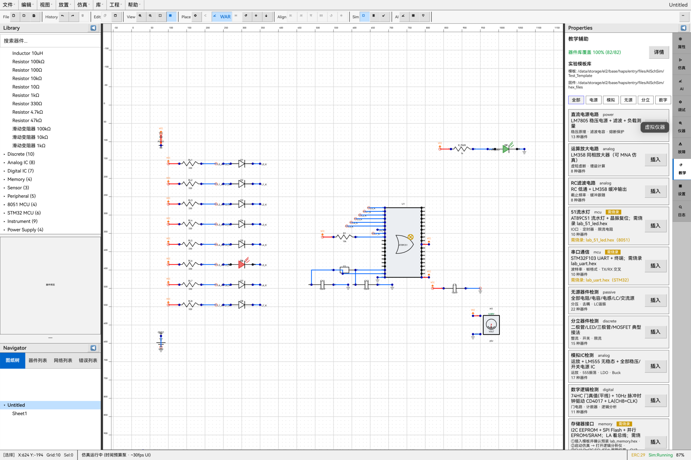
</p>

<p align="center">
  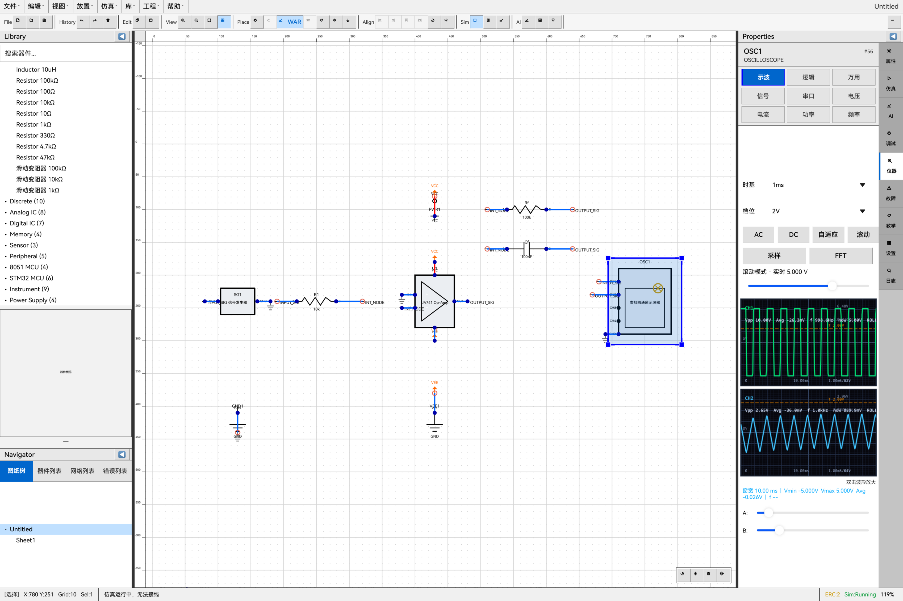
</p>

---

## 九、工程结构与模块

```
ElecDraw_Harmony/
├── AppScope/                    # 包配置与全局资源
├── entry/                       # HAP：UI 壳层与编排
│   ├── src/main/ets/
│   │   ├── pages/               # SplashPage · HomePage · Index · PcbPage
│   │   ├── services/            # AppService · HomeAnnouncement · HomeRelease
│   │   ├── components/          # 壳层 UI、仪器、TeachingPanel、PcbCanvas…
│   │   ├── theme/ · utils/ · workers/
│   │   └── …
│   └── src/main/resources/rawfile/
│       DeviceLibrary / Test_Template / hex_files / i18n / aliases
├── common/                      # 共享 HAR
│   └── src/main/ets/
│       ├── types/               # SchTopology · PcbDocument · AI / License 类型
│       ├── utils/               # ERC/DRC · WAR · autoRoutePcb · Gerber · 标注器
│       │   └── pcb_route/       # clearance · 本地策略 · 几何残件辅助
│       ├── security/            # License · FeatureGate · GitHub OAuth / Star
│       └── engines/             # 共享 MCU 教学辅助
├── features/                    # 10 个功能 HAR（见 build-profile modules）
│   ├── schematic_editor/        # 原理图编辑 + WAR
│   ├── pcb_editor/              # IPcbEditor / PcbEditorImpl
│   ├── component_library/       # BuiltinComponents + 加载器
│   ├── simulation_kernel/       # 混合仿真内核（含原生 SPICE NAPI 桩）
│   ├── hex_debugger/            # HEX / MCU 调试
│   ├── ai_engine/               # PromptLoader、原理图 Agent、WAR 适配、教学
│   ├── ai_api_manager/          # 17 提供商模板与配额
│   ├── file_persistence/        # 工程 / 导入导出 / 协作骨架
│   ├── instruments/             # 虚拟仪器引擎
│   └── plugin_system/           # 插件沙箱
├── skill/                       # ★ AI 规则总纲 + Prompt 权威源（原理图 00–09）
│   ├── SKILL.md
│   ├── prompts/                 # 00–09 → templates/*.ets
│   └── references/              # 器件目录、ERC、管脚图、pipeline-stages 等
├── DeviceLibrary/               # 三分体器件（83）+ index.lib.json
│   AnalogIC · Common · DigitalLogic · Discrete · Instrument
│   MCU · Memory · Passive · Peripheral · Power · Sensor · UserCustom
├── ai_prompt_lib/               # 遗留 LLM 提示词 JSON（非权威源）
├── Test_Template/               # 20 对实验 + template_manifest.json
├── hex_files/                   # 7 个实验固件 HEX
├── picture/                     # README / 作品说明配图
├── tools/                       # 构建、verify、audit、PCB/SCH smoke
│   ├── lab_templates/
│   └── pcb_templates/
├── docs/                        # 比赛材料与设计 plans/specs
│   └── superpowers/             # specs/ · plans/
├── project/                     # 本地工程占位
├── build-profile.json5.example  # ★ 复制为 build-profile.json5（已 gitignore）
├── oh-package.json5
├── hvigorfile.ts
└── LICENSE
```

> **说明：** `entry/oh_modules/*` 与各 feature 下的 `oh_modules/common` 为指向源码的 junction——请改 `features/` 与 `common/`，勿直接改 junction 副本。  
> **签名配置：** `build-profile.json5` 已加入 `.gitignore`（可能含证书路径）。从 `build-profile.json5.example` 复制后按本地需要填写签名。

| 模块 | 职责摘要 |
|------|----------|
| `entry` | UI 壳层、首页 / 公告 / 发布动态、业务编排、Worker 宿主、主题与快捷键；仪器面板；**PcbPage / PcbCanvas / 3D** |
| `common` | `SchTopology`、`PcbDocument`、ERC/DRC、EventBus、License / FeatureGate / GitHub 授权、WAR、**`autoRoutePcb`**、pcb_route 辅助、Gerber / 交换导出 / 标注器 |
| `schematic_editor` | 编辑命令、图层、拓扑导入导出、仿真互锁、WireAutoRouter |
| `pcb_editor` | 图层、布线、过孔、铜区、DRC、标注、经典自动布线落地 |
| `component_library` | 内置目录、SVG 缓存、器件别名 |
| `simulation_kernel` | 三引擎 + 调度器 + 故障注入 + SpiceRunner |
| `hex_debugger` | HEX、8051 / Cortex-M3、断点与行为仿真 |
| `ai_engine` | `AgentPipelineCoordinator`、`WarRouteAdapter`、PromptLoader、GA / WAR、模块并行、TeachingService |
| `ai_api_manager` | 提供商、网络模式、配额仪表盘 |
| `file_persistence` | `.schsim` / `.pcbsim`、崩溃保护、导出、第三方导入解析、协作骨架 |
| `instruments` | `VirtualInstrumentsImpl`、示波器 / LA / 表计引擎 |
| `plugin_system` | 插件生命周期与沙箱 |

**原理图 Agent：** `AgentPipelineCoordinator`、`CircuitBlackboard`、`RequirementsAgent`、`SelectAgent`、`LayoutAgent`、`NetAgent`、`RouteAgent`、`QaAgent`、`StageCritic`、`StageHooks`、`ModularModuleAgent`。

**原理图几何布线：** `WarRouteAdapter` → `WireAutoRouter`（AI RouteAgent 生产入口）。

---

## 十、快速开始

### 环境要求

- [DevEco Studio](https://developer.huawei.com/consumer/cn/deveco-studio/)，HarmonyOS SDK 需支持产品目标 **`6.1.1(24)`**  
- Node.js 18+（可选，用于 `tools/`）  
- 云端 AI：需网络权限；离线仍可编辑 / 加载实验模板 / 跑本地仿真，但 **生产 AI 整图不走模板假图**

### 首次配置

```bash
# 1. 克隆并用 DevEco Studio 打开仓库根目录
git clone https://github.com/chuqing-web/AI-Auto-Routing-Hardware-Simulation.git
cd AI-Auto-Routing-Hardware-Simulation   # 或你的本地目录名

# 2. 创建本地构建配置（已 gitignore；可含签名路径）
cp build-profile.json5.example build-profile.json5
# Windows PowerShell：
# Copy-Item build-profile.json5.example build-profile.json5

# 3. 安装 OHPM 依赖，在 2in1 设备 / PC 模拟器上 Run
ohpm install
```

### 权限说明（`entry/src/main/module.json5`）

| 权限 | 用途 |
|------|------|
| `ohos.permission.INTERNET` | 调用云端 AI API |
| `ohos.permission.GET_NETWORK_INFO` | 网络状态（AI / 授权流程） |
| `ohos.permission.READ_MEDIA` / `WRITE_MEDIA` | 工程文件读写 |

### 可选工具命令

```bash
# 重建实验 HEX
node tools/_build_lab_mcu_stm32_hex.mjs
python tools/_build_lab_uart_hex.py

# 导出运行时目录 → DeviceLibrary 三分体
node tools/export-builtin-device-library.mjs

# PCB / WAR smoke（以 tools/ 下现有脚本为准）
node tools/pcb_ai_geo_smoke.mjs
node tools/war_route_order_smoke.mjs
```

### 应用图标

- `AppScope/resources/base/media/app_icon.png`  
- `entry/src/main/resources/base/media/startIcon.png`  
- `entry/src/main/resources/base/media/layered_image.json`  

---

## 十一、演示建议（评审录屏）

建议按 5～10 分钟分镜，突出 **「工程化 Prompt → 多 Agent 门禁 → 可仿真拓扑 → PCB 板图 → 可教学验证」**：

1. **启动与首页** — Splash → Home；公告 / 发布动态；打开左侧器件库与导航。  
2. **教学模板** — 加载 `lab_uart` / `lab_555_astable` 等，展示覆盖率与知识点。  
3. **HEX 调试** — 烧录配套 HEX，运行仿真，虚拟串口收发 / 流水灯现象。  
4. **仪器联动** — 打开 `lab_amp` / `lab_filter`，示波器观察；双击波形 **全览** 后再缩放 / 平移。  
5. **AI Prompt 闭环** — 输入「STM32 最小系统 + LED」；展示澄清 / 选型 / 布局 / 建网 / WAR / QA 与 ERC。  
6. **PCB 2D / 3D** — 打开配对 `.pcbsim` 或正向标注；铜层、飞线、经典自动布线（F8 / 工具栏）；切换 **3D** 轨道 / 剖切。  
7. **模块并行（加分项）** — 复杂需求选「模块并行」，展示整体设计 → 并行子图 → joints 合并。  
8. **自检 / 故障注入** — 跑 AI 自检，或注入电阻开路等对照波形 / 诊断。  
9. **工程能力** — 保存 `.schsim` / `.pcbsim`、Gerber 预览、主题切换、AI 配额 / 离线模式（可选）。  

---

## 十二、应用场景

| 场景 | 价值 |
|------|------|
| 高校模电 / 数电 / 单片机实验 | 无实体板也能完成原理图级实验；配套 PCB 模板；Prompt 驱动答疑与拓扑生成 |
| 电子设计 / 嵌入式竞赛培训 | 快速搭电路、烧 HEX、看波形与串口；复杂题可用模块并行 + PCB 标注 / 经典自动布线 |
| 工程师方案预验证 | AI 生成初稿 + 本地仿真 + Gerber / PCB 交换导出，降低原型成本 |
| HarmonyOS 教室 / 2in1 终端 | 国产 OS 原生部署，减少 Windows 依赖 |
| AI + EDA 教学示范 | 可展示「Prompt 分阶段 + 多 Agent」原理图完整链路，并配合 PCB 教学板 |

---

## 十三、工程质量与验证

| 类型 | 位置 / 方式 |
|------|-------------|
| AI 验收套件 | `AiPipelineValidator`，经 `runValidationSuite()` 调用 |
| 多 Agent 门禁 | `qualityHardFail`、阶段批判、QA 残留中止、`usedLlm` 落图门禁 |
| PCB 布线 | 经典 `autoRoutePcb` clearance + DRC；`pcb_route/` 残件辅助 |
| 工程 verify | `tools/lab_templates/verify_*.mjs` |
| PCB 模板工具 | `tools/pcb_templates/` 手工布局 / splice / export；`tools/test_pcb_*.mjs` |
| SCH↔PCB 脚位表 | `verify_pin_bind.mjs`（若存在）：焊盘绑网断言 + 漂移检查 |
| Audit / smoke | `tools/_audit_*.mjs`、`osc_*_smoke.mjs`、`war_route_order_smoke.mjs`、`pcb_*_smoke.mjs` |
| 目录导出 | `tools/export-builtin-device-library.mjs` |
| Prompt 同步 | `skill/prompts`（00–09）↔ `features/ai_engine/.../templates/*.ets` |
| 单元测试框架 | 根依赖 `@ohos/hypium`（持续扩充中） |
| 原生集成说明 | `features/simulation_kernel/native/`（SPICE NAPI 桩） |
| 设计规格 | `docs/superpowers/specs/`、`docs/superpowers/plans/` |

**当前边界（诚实说明）：**

- 原生 SPICE NAPI 仍为桩（`native=false`），默认自研 AnalogEngine  
- MCU：进程内 Thumb / 8051 教学级模型；**外部全系统 MCU 仿真器**列入展望  
- 仿真线程：默认主线程预算泵；ThreadWorker 默认关闭  
- PCB 3D 为 Canvas 近似（非完整 CAD 内核）  
- **PCB 自动布线为经典 / 确定性引擎**——当前工作树无生产 LLM 铜箔管线  
- **SCH↔PCB 正向标注**：封装按脚位表绑网（8051/STM32/74xx/运放/555/存储器/仪器）；无专用表的未知封装可能 `FP_FALLBACK_0805` 审计并保留未绑焊盘（浮空优于误绑）  
- **PCB 反向标注**：仅回写 refDes/旋转/value/封装名，不回写完整网络（教学范围）  
- 故障注入 / 插件沙箱 / 实时协作：能力骨架或子集  
- Hypium 自动化持续扩充；核心验收以 `AiPipelineValidator` + `tools/` smoke 为主  

---

## 十四、发展展望

1. **原生 SPICE NAPI 实装** — 交叉编译 SPICE 后端，替换模拟降级路径  
2. **外部 MCU 仿真器** — 更完整的 STM32 外设级仿真  
3. **Prompt / Skill 工具链** — md→ets 半自动同步与回归 diff（原理图 00–09）  
4. **器件库扩充** — 三分体批量导入；更丰富封装 / STEP 库  
5. **PCB 加深** — 更强经典 / 几何布线、盲埋孔流程、投板级 Gerber QA；可选重新接线本地/LLM 铜箔策略  
6. **性能** — 稳定启用 ThreadWorker（帧差分）、大板渲染优化  
7. **协作与云** — 实时协同编辑与实验报告云同步  
8. **测试** — 更广的 Hypium 自动化  
9. **故障注入 / 插件沙箱** — 覆盖补全  
10. **产品官网 / 公告** — 持续完善双语首页与发布订阅（见 `docs/superpowers/plans/`）  

---

## 十五、许可证与声明

- 软件许可证：**Apache-2.0** — 完整文本见根目录 [`LICENSE`](LICENSE)；并在 `oh-package.json5` 中声明  
- 云端 AI 能力依赖第三方服务条款与配额；离线可编辑、仿真与加载原理图/PCB 实验模板，**不**静默用模板冒充 AI 整图  
- 本地 `build-profile.json5` 可能含签名密钥——切勿提交（见 `.gitignore`）  

---

**ElecDraw · AI-SCH Simulator · HarmonyOS NEXT**
