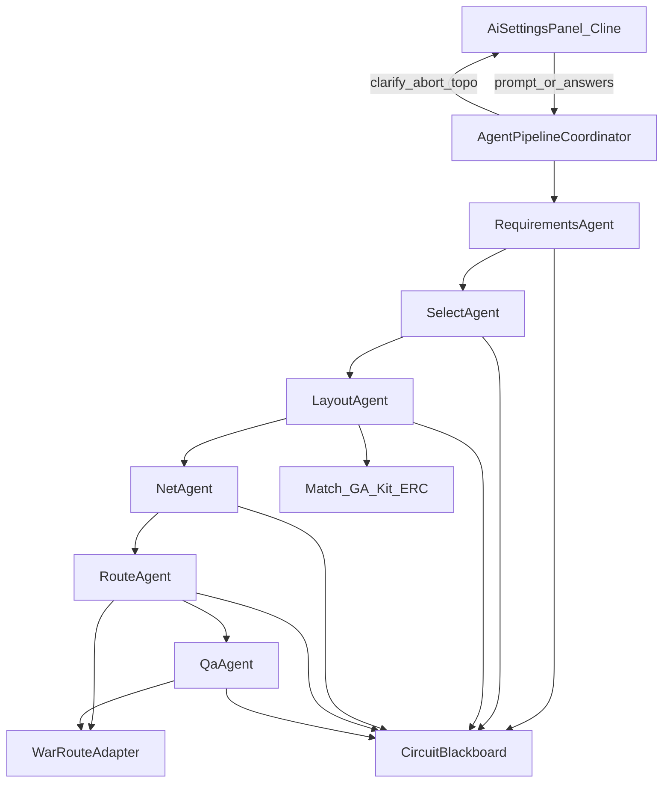

# 多 Agent 质量总线设计（优化版）

> 状态：待用户确认后进入实现  
> 日期：2026-07-24（2026-07-27 全面优化：分期、WAR 适配、Layout/QA 契约）  
> 相关 Cursor plan：`多agent质量总线_90dc6e8d`

## 1. 目标与分期

生产路径从「单体 `AiPipelineOrchestrator` + 可降级 / 永不中止」改为质量优先的阶段 Agent 流水线。

**已锁定产品约束**

- 关键阶段失败或门禁不过 → 整单硬中止，禁止本地降级出图  
- 推理模型 + 每阶段生成 / 批判 / 修正（有上限）  
- 歧义时必要时追问（A/B/C + D）  
- 落线与主编辑器共用 WAR  
- 右侧 AI 栏交互参考 Cline  
- `skipLlm` 验收路径保留、与生产隔离  

### Phase 1（tracer bullet，首版必须）

只打通 **oneshot `text_gen`**：六阶段 + 硬失败 + 澄清 + WAR + Cline 侧栏最小可用。

**不做**：Modular Agent 化、推理 API 开关、黑板快照续跑、真 pub/sub Bus、完整 Plan/Act。

### Phase 2

Modular fork、推理参数、澄清快照续跑、edit/append/自检挂同一 Coordinator。

## 2. 架构（Phase 1）

- **调度**：Coordinator **顺序 await**，共享 Blackboard；Phase 1 不做 pub/sub AgentBus。  
- **入口**：`AiSettingsPanel → AppService.aiGenerateCircuitFromPrompt → TASK_FULL_PIPELINE → Coordinator`。

## 3. 关键契约（审阅补洞）

### 3.1 Layout

- LLM 可出网格 `positions` 作为 **GA 软提示**；最终坐标只来自 `PlacementOptimizer`。  
- 导线几何坐标仍禁止由 LLM 输出。

### 3.2 WAR 交接

`WarRouteAdapter`：net 导线对 → `WarRouteContext` → `WireAutoRouter` → `RouteLine`。  
应导线网 WAR 失败 → Route HARD。生产禁止 `ConstrainedWiringEngine` 几何寻路；FixKit 补线改适配器或 Phase 1 禁用依赖旧引擎的 fix。

### 3.3 QA

最多 2 轮有限修复（WAR 重拉 / Kit 仪器 / 明确标号 / heal），再检不过或偏离 `RequirementSpec` → ABORT。禁止 FORCE_COMPLETE / demote_all 冒充成功。

### 3.4 批判上限

Requirements 2；Select/Layout/Net/Route 3；QA fix 2。耗尽 ABORT 并展示 HARD 摘要。

### 3.5 RequirementSpec（最小）

`summary`, `modules[]`, `power`, `needsMcu`, `instruments[]`, `measureGoals[]`, `constraints[]`, `oodHints[]`, `openQuestions[]`。

### 3.6 取消与让出

阶段 / chat / WAR 检查取消；长循环让出主线程；不缩短 ~30min 读超时。

### 3.7 澄清代价

Phase 1 答完从 Requirements 整链重跑；Phase 2 快照续跑。

## 4. 六个 Agent

| Agent | LLM | Tools | 失败 |
|-------|-----|-------|------|
| Requirements | 需求 + 歧义；CapabilityDigest | — | 澄清 / ABORT |
| Select | device_select；全库 ID | DeviceSelectEngine | ABORT |
| Layout | 约束 + position hints | PlacementOptimizer | ABORT |
| Net | net_plan | NetPlanExecutor | ABORT；禁 Semantic 生产回退 |
| Route | mode/优先级 | WarRouteAdapter / WAR | ABORT |
| QA | 对照需求 | ERC/geo + 有限修复 | ABORT |

## 5. Cline 侧栏 + 澄清

顶栏（任务/取消/API 齿轮）→ 对话时间线 → 底栏输入。  
Ask 卡片：A/B/C 按钮 + D（空跳过）；D 优先。Proteus 主题，不嵌 Cline WebView。

## 6. 旁路范围（Phase 1）

| 路径 | 行为 |
|------|------|
| oneshot text_gen | Coordinator |
| modular | 禁用或提示 Phase2 |
| edit / append | 不承诺同门禁；可强制 oneshot 或旧路径 |
| 自检修复 | 暂旧逻辑；禁模板整图；补线尽量 WAR |

生产切割：NEVER_ABORT、FORCE_COMPLETE 脏交付、defaultConstraints 降级、部分 BOM 凑合、生产 Semantic/旧 A* 寻路、intent 启发式当需求主路径。

## 7. StageHooks

`beforeStage` / `afterGenerate` / `afterTools` / `afterCritique` / `onClarification` / `beforeCommitCanvas`（usedLlm + clean 才落图）。

## 8. 实施顺序

**Phase 1：** 类型+Coordinator → WAR+Adapter → 六 Agent 硬失败 → 澄清+Cline UI → QA 有限修复 → 验收+skill  

**Phase 2：** 推理 API → Modular → 快照续跑 / edit·自检挂接  

## 9. 验收（Phase 1）

- 无 degraded 默认约束、无 FORCE_COMPLETE 脏交付  
- 阶段失败不落图；Ask 澄清可用  
- Cline 布局；`route via WAR`  
- HARD 上限文案；`skipLlm` 仍可跑  

---

## 附录 A：Grok Build 五层与 Hooks

参考 [xai-org/grok-build](https://github.com/xAI-org/grok-build)：分层与 hooks 模式。  
实现以本仓 ArkTS 为准；不引入其 Rust 仓 / coding tools / TUI。  
Phase 1：runtime=Coordinator；tools=Match/GA/WAR/Kit/ERC；host=Blackboard+落图边界；ui=Cline 侧栏。

## 10. 请用户确认

请确认本优化版。确认后按 Phase 1 任务拆分实现（`docs/superpowers/plans/` 可另开实施计划）。
