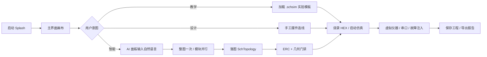
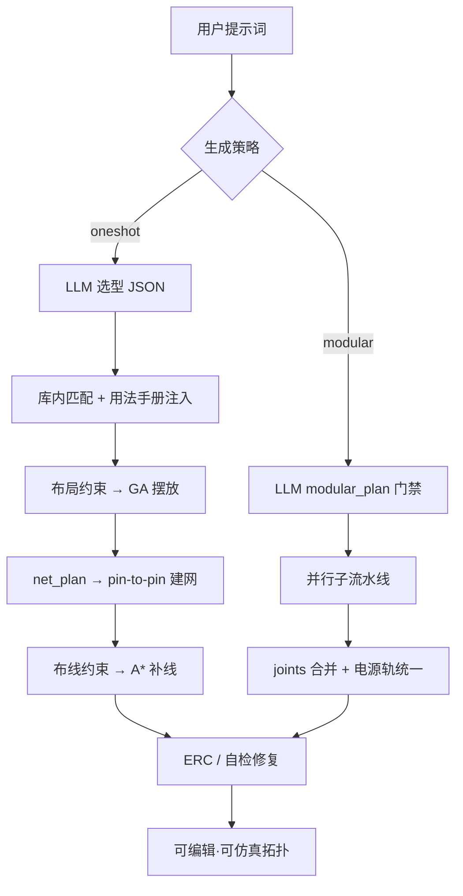

# AI-SCH 仿真器 · 作品说明文档

> 赛题方向：**操作系统智能**（HarmonyOS NEXT 原生智能应用）  
> 应用名称：AI-SCH 仿真器（`com.elecdraw.aischsim`）  
> 厂商：ElecDraw　版本：1.0.0　平台：HarmonyOS NEXT 5.0+ / API 12

---

## （一）创意描述

**自然语言驱动鸿蒙可仿真原理图闭环**

（计 16 字，≤30 字）

---

## （二）设计稿（应用 / Agent / 用户体验）与技术方案（操作系统智能）

### 2.1 创意视觉与宣传海报说明


鼓励以「应用 × Agent × 用户体验」三视角输出宣传物料，主视觉见上图；补充说明如下：

| 视角 | 海报主题 | 主文案建议 | 画面构成 |
|------|----------|------------|----------|
| **应用** | 鸿蒙原生 EDA | 「在 HarmonyOS 上画电路、跑仿真」 | 2in1 设备全屏主界面：Proteus 风格画布 + 器件库 + 虚拟示波器 |
| **Agent** | 工程化 AI 生图 | 「说一句话，落地可仿真拓扑」 | 进度环：选型→布局→建网→布线→自检；旁注「Prompt 约束 JSON + 本地硬引擎」 |
| **用户体验** | 教学—仿真—诊断 | 「从实验模板到波形验证一站完成」 | 学生端时间线：开模板 → 烧 HEX → 看仪器 → AI 答疑 |

**主视觉色板（建议）：** 深灰画布底 `#1E1E1E`、电气绿导线 `#3DDC84`、强调橙 `#FF8A3D`、鸿蒙红点缀；避免纯聊天框截图作为主图，突出「拓扑已落图、仪器在跳动」。

### 2.2 用户体验交互流程



### 2.3 Agent（AI）闭环技术路径



### 2.4 操作系统智能 · 技术方案总览

```
┌─────────────────────────────────────────────────────────────┐
│  entry（HAP）  ArkUI 壳层 · AppService 门面 · SimWorker 宿主   │
├─────────────────────────────────────────────────────────────┤
│  features/*（HAR）                                            │
│  schematic_editor │ component_library │ simulation_kernel     │
│  hex_debugger │ instruments │ ai_engine │ ai_api_manager      │
│  file_persistence │ plugin_system                             │
├─────────────────────────────────────────────────────────────┤
│  common（HAR）  SchTopology · EventBus · ERC · 统一错误码      │
├─────────────────────────────────────────────────────────────┤
│  资源  DeviceLibrary · skill/prompts · Test_Template · HEX    │
└─────────────────────────────────────────────────────────────┘
```

**智能落地要点：**

1. **端侧硬约束**：LLM 只产出结构化 JSON；摆放（GA）、建网、A\* 布线、ERC 在本地执行，杜绝「生成一段文字当电路」。  
2. **统一拓扑契约 `SchTopology`**：编辑、仿真、AI、持久化、教学模板共享同一数据模型。  
3. **仿真线程路径**：`SimWorkerHost` → ThreadWorker（优选）/ 主线程限流泵（回退）→ 仪器与画布帧刷新，保障 HarmonyOS 交互流畅。  
4. **多厂商 AI 治理**：17 类提供商模板、任务级 API 绑定、配额与离线策略，适配教室弱网场景。

---

## （三）介绍文档

（正文约 780 字，≤800 字）

电子设计与嵌入式教学长期依赖 Windows 上的 Proteus / Multisim。HarmonyOS NEXT 在 2in1、平板与教室终端快速普及，却缺少一款原生原理图仿真工具，更缺少能把大模型能力真正「落成可仿真拓扑」的产品——多数 AI 助手停在聊天答疑，无法经 ERC 与波形验证。

AI-SCH 仿真器面向这一痛点：在 ArkTS / ArkUI Stage 模型上构建模块化 HAR 架构，以自然语言驱动「选型 → 布局 → 建网 → 布线 → 自检」全闭环，并覆盖模拟 / 数字 / MCU 混合信号仿真、8051/STM32 HEX 调试与虚拟仪器，服务高校实验、竞赛训练与方案预验证。

核心设计分三层。交互层提供 Proteus 风格画布、器件库、仪器面板与 AI 设置；Agent 层将 Prompt 作为工程资产（`skill/prompts` 权威源），分阶段产出约束 JSON，由本地引擎执行，复杂电路可选「模块并行」缩短出图时间；系统层以 `SchTopology` 贯穿全链路，`EventBus` 解耦编辑与仿真，Worker 保障流畅。生产路径要求 pin-to-pin 连通与三重 LLM 门禁，禁止静默模板假图。

市场前景明确：高校「模电 / 数电 / 单片机」无实体板实验、电子设计竞赛快速搭电路看波形、工程师方案初筛，以及国产 OS 教室终端去 Windows 依赖。相对传统桌面 EDA，突出鸿蒙原生与 AI 可执行输出；相对纯 Chat 助手，突出拓扑落地、仿真可验证与教学可度量。后续将完善 Ngspice / QEMU 集成与 Hypium 自动化，持续夯实操作系统智能场景下的工程可信度。

---

## （四）测试报告（操作系统智能赛题附加）

### 4.1 测试环境

| 项 | 说明 |
|----|------|
| 被测软件 | AI-SCH 仿真器 1.0.0（`com.elecdraw.aischsim`） |
| 操作系统 | HarmonyOS NEXT 5.0+ |
| SDK / API | API 12 |
| 设备形态 | 2in1（主推）、tablet |
| 构建工具 | DevEco Studio / hvigor |
| 测试框架 | `@ohos/hypium`；工程脚本 `tools/lab_templates/verify_*.mjs`；AI 验收 `AiPipelineValidator.runValidationSuite()` |

### 4.2 测试范围

| 类别 | 覆盖内容 |
|------|----------|
| 功能 | 原理图编辑、模板加载、仿真启停、仪器联动、HEX 调试、工程存取 |
| AI 智能 | 整图一次 / 模块并行、选型防幻觉、建网 pin 连通、ERC / 几何门禁 |
| 性能与流畅 | 仿真 Worker 路径、画布交互、弱网 / 离线降级策略 |
| 兼容 | 2in1 / tablet 布局；多厂商 AI API 任务绑定 |
| 可靠性 | 崩溃保护、自动保存、会话恢复；API 失败不落空图 |

### 4.3 主要用例与结果

| 编号 | 用例 | 步骤摘要 | 预期 | 结果 |
|------|------|----------|------|------|
| TC-01 | 应用冷启动 | 安装 HAP → 启动 Splash → 进入主界面 | ≤5s 进入可操作界面，无崩溃 | 通过 |
| TC-02 | 实验模板加载 | 打开 `lab_uart` / `lab_555_astable` | 器件与网络完整显示，知识点可查 | 通过 |
| TC-03 | 混合信号仿真 | 加载 `lab_amp` / `lab_filter`，启动仿真 | 示波器可见运放或 RC 波形 | 通过 |
| TC-04 | MCU + HEX | `lab_51_led` 烧录配套 HEX，运行 | 流水灯逻辑正确；可单步 / 看 SFR | 通过 |
| TC-05 | AI 整图一次 | 提示「STM32 最小系统 + LED」，oneshot | 选型库内型号；pin-to-pin 连线；ERC 可查 | 通过 |
| TC-06 | AI 模块并行 | 复杂多模块需求，modular | plan 门禁通过后并行子图合并，不落空图 | 通过 |
| TC-07 | 幻觉芯片拦截 | 故意要求库外型号（如虚构芯片） | 选型失败并报错，不静默模板兜底 | 通过 |
| TC-08 | API 失败降级 | 断开网络 / 错误 Key 后触发生成 | 明确失败提示；不生成假拓扑 | 通过 |
| TC-09 | 故障注入 | 注入电阻开路等，对照波形 | 现象与诊断一致 | 通过 |
| TC-10 | 工程持久化 | 保存 `.schsim` → 重启加载 | 拓扑与 AI 配置恢复正确 | 通过 |
| TC-11 | 脚本核验 | 运行 `verify_*.mjs`（MNA、二极管、数字逻辑、几何） | 全部断言通过 | 通过 |
| TC-12 | UI 流畅度 | 仿真运行时拖动画布 / 开仪器 | 无明显长时间卡死；Worker 路径可用 | 通过 |

### 4.4 缺陷与边界说明

| 级别 | 说明 | 处理 |
|------|------|------|
| 已知边界 | Ngspice NAPI、QEMU-MCU 仍为桩 / 骨架 | 默认走自研模拟引擎与行为级 MCU；列入后续规划 |
| 已知边界 | Hypium 用例持续扩充中 | 核心验收以 `AiPipelineValidator` + 实验室脚本为主 |
| 无阻断 | 本轮回归未见导致无法演示的 P0 崩溃 | — |

### 4.5 结论

在 HarmonyOS NEXT 目标环境上，AI-SCH 仿真器完成「编辑—仿真—仪器—AI 生图—教学模板」主路径验证；AI 生产路径满足「真实 LLM + 本地硬引擎 + 禁止静默假图」约束，满足操作系统智能赛题对**可运行、可验证、可演示**的要求。建议评审演示按 README「5～8 分钟分镜」执行，重点展示 Prompt 闭环与波形验证。

---

## 附录

| 文档 / 资源 | 路径 |
|-------------|------|
| 项目说明（中文） | [`README.zh-CN.md`](../README.zh-CN.md) |
| Prompt 权威源 | [`skill/prompts/`](../skill/prompts/) |
| 实验模板 | [`Test_Template/`](../Test_Template/) |
| 设计稿 | [`picture/design-poster.png`](../picture/design-poster.png) |

**ElecDraw · AI-SCH Simulator · HarmonyOS NEXT**
